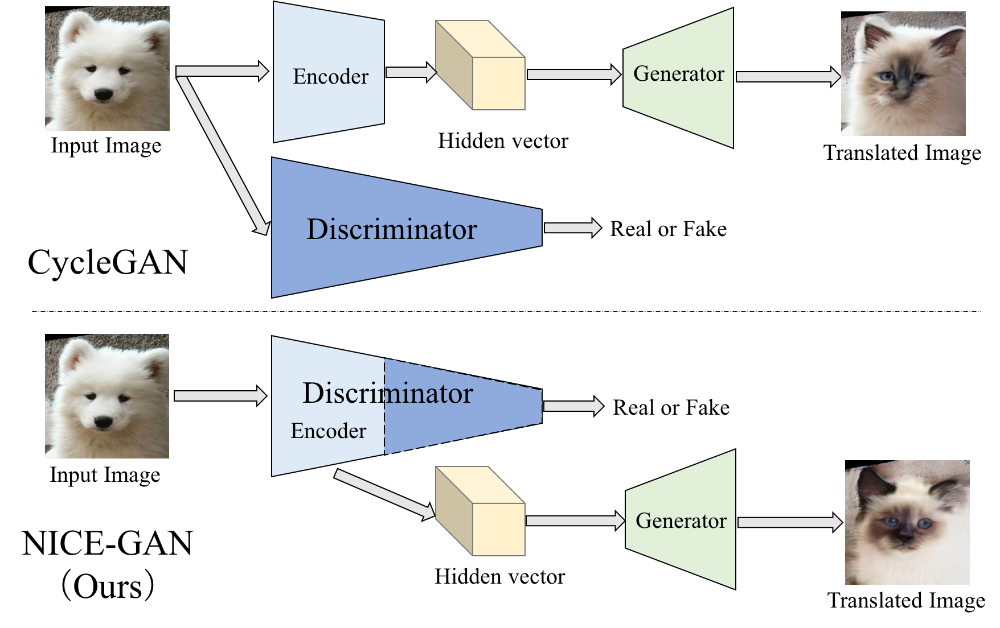
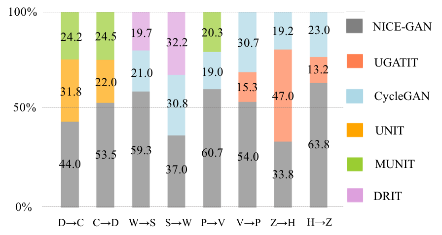
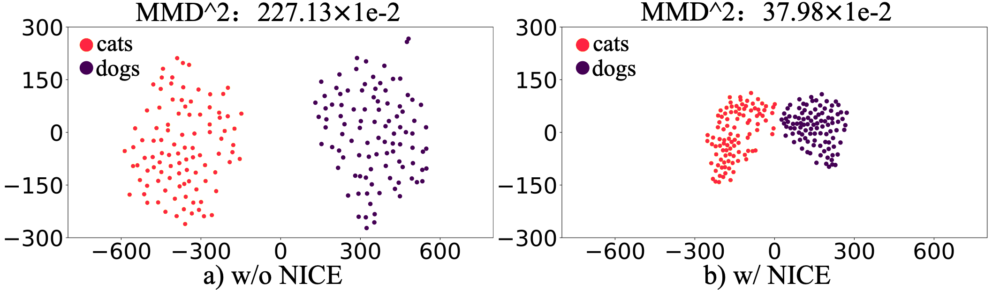
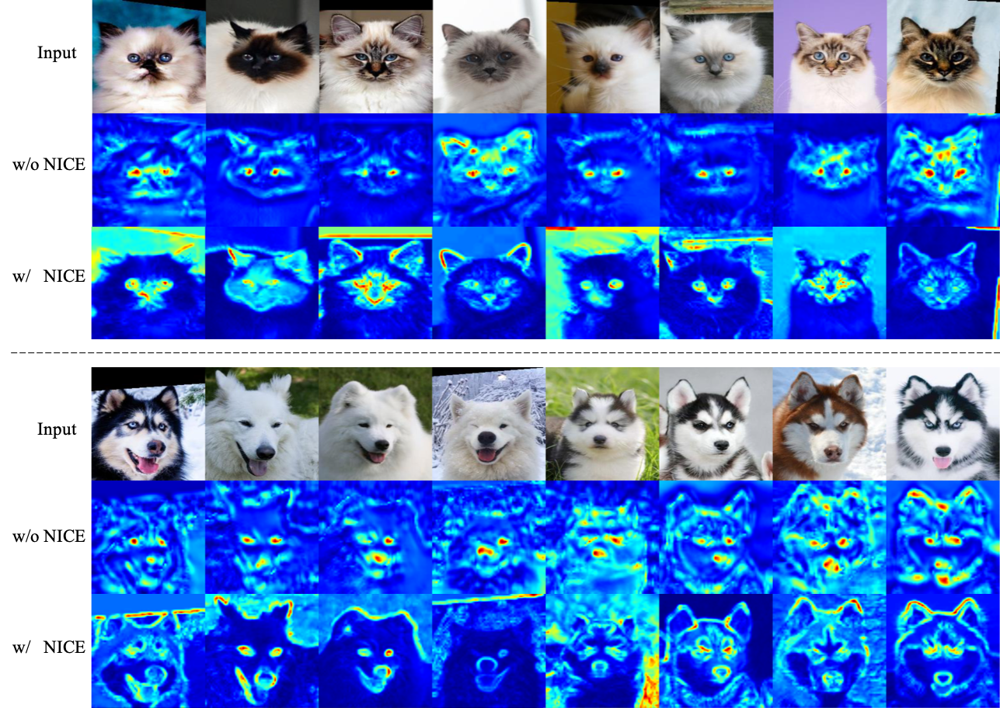
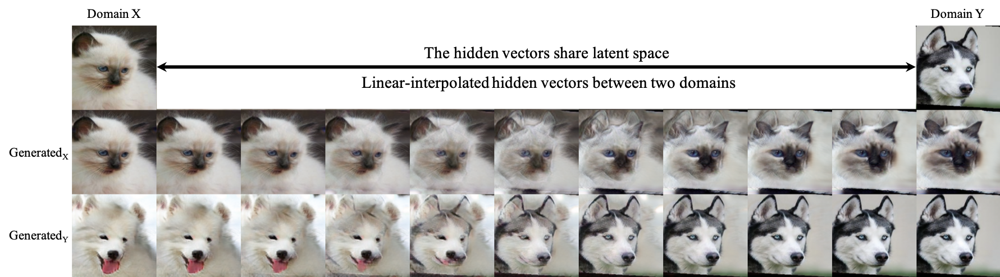

## NICE-GAN &mdash; Official PyTorch Implementation [[Project Page]](https://alpc91.github.io/NICE-GAN-pytorch)
### Reusing Discriminators for Encoding: Towards Unsupervised Image-to-Image Translation

<div align="center">
  
</div>


### [Paper](https://arxiv.org/abs/2003.00273) 

> **Reusing Discriminators for Encoding: Towards Unsupervised Image-to-Image Translation**<br>
>
> **Abstract** *Unsupervised image-to-image translation is a central task in computer vision. Current translation frameworks will abandon the discriminator once the training process is completed. This paper contends a novel role of the discriminator by reusing it for encoding the images of the target domain. The proposed architecture, termed as NICE-GAN, exhibits two advantageous patterns over previous approaches: First, it is more compact since no independent encoding component is required; Second, this plug-in encoder is directly trained by the adversary loss, making it more informative and trained more effectively if a multi-scale discriminator is applied. The main issue in NICE-GAN is the coupling of translation with discrimination along the encoder, which could incur training inconsistency when we play the min-max game via GAN. To tackle this issue, we develop a decoupled training strategy by which the encoder is only trained when maximizing the adversary loss while keeping frozen otherwise. Extensive experiments on four popular benchmarks demonstrate the superior performance of NICE-GAN over state-of-the-art methods in terms of FID, KID, and also human preference. Comprehensive ablation studies are also carried out to isolate the validity of each proposed component.*

## Author
Runfa Chen, Wenbing Huang, Binghui Huang, Fuchun Sun, Bin Fang
[Tsinghua Robot Learning Lab](https://github.com/tsinghua-rll)

## Citation
If you find this code useful for your research, please cite our paper:

```
@InProceedings{Chen_2020_CVPR,
author = {Chen, Runfa and Huang, Wenbing and Huang, Binghui and Sun, Fuchun and Fang, Bin},
title = {Reusing Discriminators for Encoding: Towards Unsupervised Image-to-Image Translation},
booktitle = {Proceedings of the IEEE/CVF Conference on Computer Vision and Pattern Recognition (CVPR)},
month = {June},
year = {2020}
}
```

## Usage
```
├── dataset
   └── YOUR_DATASET_NAME
       ├── trainA
           ├── xxx.jpg (name, format doesn't matter)
           ├── yyy.png
           └── ...
       ├── trainB
           ├── zzz.jpg
           ├── www.png
           └── ...
       ├── testA
           ├── aaa.jpg 
           ├── bbb.png
           └── ...
       └── testB
           ├── ccc.jpg 
           ├── ddd.png
           └── ...
```
### Prerequisites
* Python 3.6.9 
* Pytorch 1.1.0 and torchvision (https://pytorch.org/)
* TensorboardX
* Tensorflow (for tensorboard usage)
* CUDA 10.0.130, CuDNN 7.3, and Ubuntu 16.04.


### Train
```
> python main.py --dataset cat2dog
```
* If the memory of gpu is **not sufficient**, set `--light` to True

### Restoring from the previous checkpoint
```
> python main.py --dataset cat2dog --resume True
```
* Previous checkpoint:  **dataset**_params_latest.pt
* If the memory of gpu is **not sufficient**, set `--light` to True
* Trained models(set --light to True):
Our previous checkpoint on cat2dog can be downloaded from https://drive.google.com/open?id=1gIA5yhkY71zasY_lXheNjYvphqwhN0Os

### Test
```
> python main.py --dataset cat2dog --phase test
```

### Metric
```
> python fid_kid.py testA fakeA --mmd-var 
```
* You can use gpu, set `--gpu` to **the index of gpu**, such as `--gpu 0`

## Network
<div align="center">
  
</div>

## Comparison
<div align="center">
  
</div>

## User study
<div align="center">
  
</div>

## t-SNE
<div align="center">
  
</div>

## Heatmaps
<div align="center">
  
</div>

## Shared latent space
<div align="center">
  
</div>

## Acknowledgments
Our code is inspired by [UGATIT-pytorch](https://github.com/znxlwm/UGATIT-pytorch).


